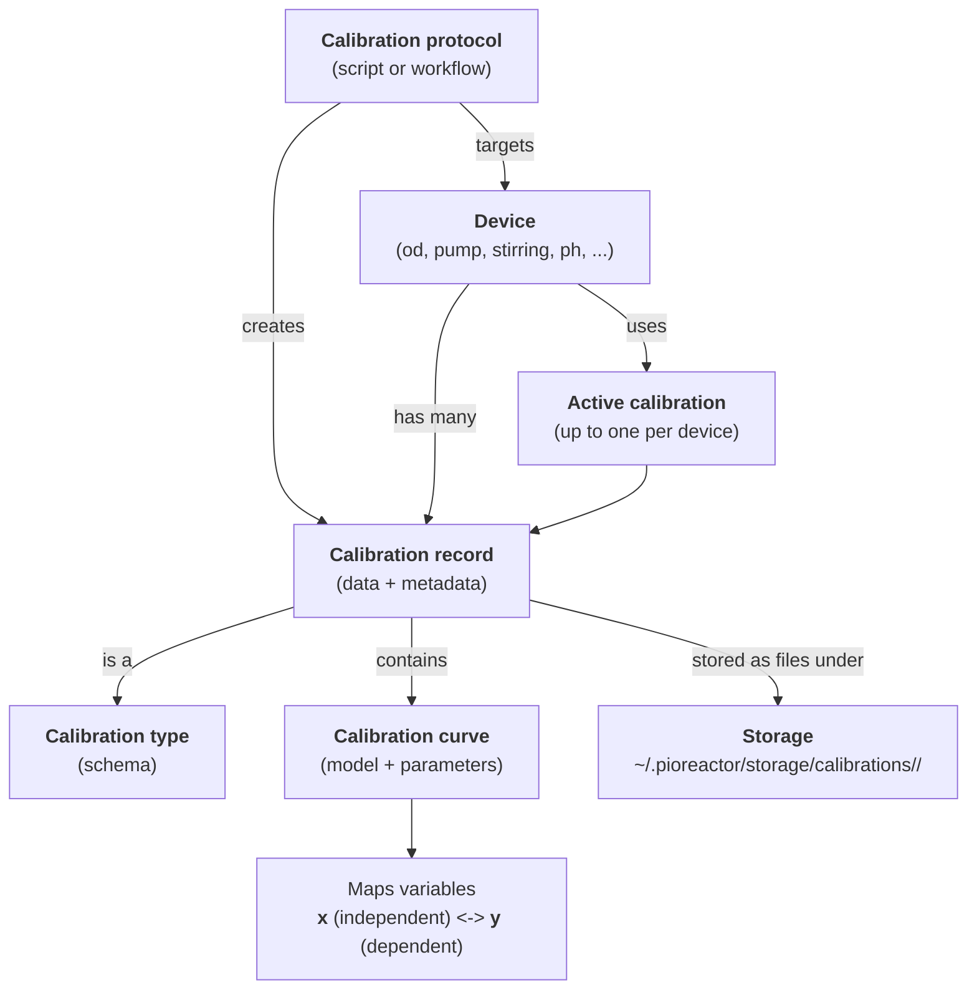

Calibrations went through a major rewrite in the 25.1.x release of Pioreactor. The current design is much more adaptable and simple than the previous design. Let's discuss the key points of the current calibration design:

0. A _calibration_ relates two variables together. One of the variables is what we can vary (in theory), and the other quantity is the target.
1. The calibration relates the two via a _calibration curve_, which is just a mapping between the two variables.
1. The Pioreactor has many _devices_ that can be calibrated. For example, the OD system, media pump, waste pump, or stirring, can all be improved with a calibration being given. A device can have multiple calibrations, but only one can be _active_ at a time. The device looks for the _active_ calibration, and uses that in practice.
2. A _protocol_ can be used to create a calibration for a device. Devices could have multiple protocols that can create calibrations.
1. A calibration can be given to possible multiple devices. Example: the same calibration can be used for waste and media pumps.

In practice, calibrations are stored as YAML files on the Pioreactor, in `~/.pioreactor/storage/calibrations` , divided into directories by the associated device. By keeping the calibrations as files (instead of in a database) makes moving, sharing, and editing calibrations really easy.




### CLI tools

There is a useful CLI available to manage calibrations, too: `pio calibrations --help`.

## Creating a new device

Create a new device is easy: just add a new folder to `~/.pioreactor/storage/calibrations` with the device name. This device name is used elsewhere, so keep it simple and easy to use.

For example, let's create a pH device, named `ph`. SSH into your Pioreactor and run
```
mkdir ~/.pioreactor/storage/calibrations/ph
chown pioreactor:www-data ~/.pioreactor/storage/calibrations/ph
```

The `chown` is required so that the webserver can access that folder to read from it.


## Creating a new calibration type

A device can be calibrated by different _types_ of calibrations. For example, you many want to relate the volume that pumps move to the duration the pump is ON for, *or* relate the volume to the amount of power applied in 1 second interval. These are different calibration _types_. To create a new calibration type, you need to define its unique schema.

Continuing our pH example, the calibration type for it might look like:

```python
from pioreactor.structs import CalibrationBase # see this class for the full list of fields

class PHBufferCalibration(CalibrationBase, kw_only=True, tag="ph_buffer"):
    x: str = "pH"       # required
    y: str = "Voltage"  # required

    # add some optional metadata fields
    buffer_solution: t.Literal["4.01", "7.00", "10.01"]
    electrode_type: str

    # not required, but helpful
    def voltage_to_ph(self, voltage: float) -> float:
        return self.y_to_x(voltage)

    def ph_to_voltage(self, ph: float) -> float:
        return self.x_to_y(ph)
```

The `tag` should be unique for this calibration type. For example, if we instead had another pH calibration type that used optics instead of buggers, we could define another pH calibration type as follows:

```python
class PHOpticsCalibration(CalibrationBase, kw_only=True, tag="optical_ph"):
    x: str = "pH"
    y: str = "Lumens"
```

It's optional, but we also defined some helper functions `voltage_to_ph` and `ph_to_voltage` to easily map between the variables. Internally, They call `x_to_y` and `y_to_x` functions which are always available on a calibration object. They do the hard math behind mapping variables to each other.


## (Optional) Creating a new protocol for an existing device

If you want to add a custom script to create a calibration on the Pioreactor, you can do that by creating a new protocol.


Define a `CalibrationProtocol` subclass that will hold metadata for your protocol. It should have a `run` method that returns a calibration (a subclass of `CalibrationBase` - see above). If your protocol supports session-based UI/CLI flows, also define a step registry and a `start_session` classmethod.

```python
from pioreactor.calibrations import CalibrationProtocol
from pioreactor.utils.timing import current_utc_datetime
from pioreactor import whoami


class BufferBasedPHProtocol(CalibrationProtocol):
    target_device = "ph"
    protocol_name = "buffer_based"
    description = "Calibrate the pH sensor using buffer solutions"
    step_registry = PH_STEPS

    @classmethod
    def start_session(cls, target_device: str) -> CalibrationSession:
        return start_ph_buffer_session(target_device)

    def run(self, target_device: str):
        return run_ph_buffer_calibration()


def run_ph_buffer_calibration():
    # run the calibration, look at other calibration examples to re use code.
    ...

    return PHBufferCalibration(
        calibration_name="ph_calibration",
        calibrated_on_pioreactor_unit=whoami.get_unit_name(),
        created_at=current_utc_datetime(),
        curve_data_=[2, 3, 5],
        curve_type="poly",
        x="Voltage",
        y="pH",
        recorded_data={"x": [0.1, 0.2, 0.3], "y": [1.0, 2.0, 3.0]},
        buffer_solution="10.01",
        electrode_type="glass"
    )
```


## Session-based flows (UI + CLI)

Session-based calibrations use `SessionStep` classes to define the flow once and render it in both the UI and CLI. A typical pattern is:

1. Define `SessionStep` subclasses with `step_id`, `render(ctx)`, and `advance(ctx)`.
2. Create a `StepRegistry` mapping `{step_id: StepClass}`.
3. Expose `start_<protocol>_session`, `get_<protocol>_step` (uses `get_session_step`), and `advance_<protocol>_session` (uses `advance_session`).
4. In `run(...)`, call `run_session_in_cli(step_registry, session)` to reuse the same flow in CLI.

Key details:

- Step classes should keep `render` (display) and `advance` (state changes) single-purpose and explicit.
- Terminal steps are auto-included by `get_session_step`, `advance_session`, and `run_session_in_cli`. Use `ctx.complete(...)` to finish (renders `CalibrationComplete`) and `ctx.abort(...)` / `ctx.fail(...)` to end early (renders `CalibrationEnded`).
- UI sessions must perform hardware access through the Huey executor (`SessionContext.executor`). Define executor actions in `core/pioreactor/web/tasks.py` and dispatch them from `core/pioreactor/web/unit_calibration_sessions_api.py`.
- Chart snapshots: populate `step.metadata.chart` with `title`, `x_label`, `y_label`, and `series` (points + optional curve). The UI renders them and the CLI uses plotext via `plot_data` in `core/pioreactor/calibrations/utils.py`.

This keeps CLI and UI behavior consistent and avoids bespoke click-driven scripts.

Example (minimal session flow):

```python
from pioreactor.calibrations.session_flow import SessionStep
from pioreactor.calibrations.session_flow import StepRegistry
from pioreactor.calibrations.session_flow import advance_session
from pioreactor.calibrations.session_flow import get_session_step
from pioreactor.calibrations.session_flow import run_session_in_cli
from pioreactor.calibrations.session_flow import steps, fields
from pioreactor.calibrations.structured_session import CalibrationSession
from pioreactor.calibrations.structured_session import utc_iso_timestamp
from pioreactor.utils.timing import current_utc_datetime
from pioreactor import structs

class Intro(SessionStep):
    step_id = "intro"

    def render(self, ctx):
        return steps.info("pH calibration", "Place probe in buffer.")

    def advance(self, ctx):
        return Measure()

class Measure(SessionStep):
    step_id = "measure"

    def render(self, ctx):
        return steps.form(
            "Measure buffer",
            "Record voltage and pH.",
            [fields.float("voltage", minimum=0), fields.float("ph", minimum=0, maximum=14)],
        )

    def advance(self, ctx):
        voltage = ctx.inputs.float("voltage", minimum=0)
        ph_value = ctx.inputs.float("ph", minimum=0, maximum=14)
        calibration = structs.CalibrationBase(
            calibration_name="ph-cal",
            calibrated_on_pioreactor_unit="unit",
            created_at=current_utc_datetime(),
            curve_type="poly",
            curve_data_=[1.0, 0.0],
            x="voltage",
            y="ph",
            recorded_data={"x": [voltage], "y": [ph_value]},
        )
        link = ctx.store_calibration(calibration, "ph")
        ctx.complete({"calibration": link})
        return None

PH_STEPS: StepRegistry = {
    Intro.step_id: Intro,
    Measure.step_id: Measure,
}

def start_ph_session() -> CalibrationSession:
    now = utc_iso_timestamp()
    return CalibrationSession(
        session_id="...",
        protocol_name="ph_two_point",
        target_device="ph",
        status="in_progress",
        step_id=Intro.step_id,
        data={},
        created_at=now,
        updated_at=now,
    )

def get_ph_step(session, executor=None):
    return get_session_step(PH_STEPS, session, executor)

def advance_ph_session(session, inputs, executor=None):
    return advance_session(PH_STEPS, session, inputs, executor)

def run_ph_calibration():
    session = start_ph_session()
    return run_session_in_cli(PH_STEPS, session)
```

Example chart metadata (render side):

```python
chart = {
    "title": "Calibration progress",
    "x_label": "Voltage",
    "y_label": "pH",
    "series": [{"id": "ph", "label": "Measured", "points": [{"x": 2.1, "y": 7.0}]}],
}
step = steps.form("Measure", "Record reading.", [...])
step.metadata = {"chart": chart}
```


## Adding it to the plugins folder

You can add your code to the `~/.pioreactor/plugins` folder on the Pioreactor, it will auto-magically populate the CLI
and UI. To complete our pH example, add the following to a new Python file in the `~/.pioreactor/plugins` folder:

```python
from __future__ import annotations
from pioreactor.calibrations import CalibrationProtocol
from pioreactor.structs import CalibrationBase
from pioreactor.utils.timing import current_utc_datetime
from pioreactor import whoami
import typing as t
from pioreactor.calibrations.session_flow import SessionStep
from pioreactor.calibrations.session_flow import StepRegistry
from pioreactor.calibrations.session_flow import advance_session
from pioreactor.calibrations.session_flow import get_session_step
from pioreactor.calibrations.session_flow import run_session_in_cli
from pioreactor.calibrations.session_flow import steps, fields
from pioreactor.calibrations.structured_session import CalibrationSession
from pioreactor.calibrations.structured_session import utc_iso_timestamp

class PHBufferCalibration(CalibrationBase, kw_only=True, tag="ph_buffer"):
    x: str = "pH"       # required
    y: str = "Voltage"  # required

    buffer_solution: t.Literal["4.01", "7.00", "10.01"]
    electrode_type: str

    def voltage_to_ph(self, voltage: float):
        return self.y_to_x(voltage)

    def ph_to_voltage(self, ph: float):
        return self.x_to_y(ph)

class BufferBasedPHProtocol(CalibrationProtocol):
    target_device = "ph"
    protocol_name = "buffer_based"
    description = "Calibrate the pH sensor using buffer solutions"
    step_registry = PH_STEPS

    @classmethod
    def start_session(cls, target_device: str) -> CalibrationSession:
        return start_ph_buffer_session(target_device)
    step_registry = PH_STEPS

    @classmethod
    def start_session(cls, target_device: str) -> CalibrationSession:
        return start_ph_buffer_session(target_device)

    def run(self, target_device: str):
        return run_ph_buffer_calibration()

def run_ph_buffer_calibration():
    # run the calibration to get data
    ...

    return PHBufferCalibration(
        calibration_name="ph_calibration",
        calibrated_on_pioreactor_unit=whoami.get_unit_name(),
        created_at=current_utc_datetime(),
        curve_data_=[2, 3, 5],
        curve_type="poly",
        x="Voltage",
        y="pH",
        recorded_data={"x": [0.1, 0.2, 0.3], "y": [1.0, 2.0, 3.0]},
        buffer_solution="default",
        electrode_type="glass"
    )

# Session steps (UI + CLI flow)
class Intro(SessionStep):
    step_id = "intro"

    def render(self, ctx):
        return steps.info("pH calibration", "Place probe in buffer.")

    def advance(self, ctx):
        return Measure()

class Measure(SessionStep):
    step_id = "measure"

    def render(self, ctx):
        return steps.form(
            "Measure buffer",
            "Record voltage and pH.",
            [fields.float("voltage", minimum=0), fields.float("ph", minimum=0, maximum=14)],
        )

    def advance(self, ctx):
        voltage = ctx.inputs.float("voltage", minimum=0)
        ph_value = ctx.inputs.float("ph", minimum=0, maximum=14)
        calibration = PHBufferCalibration(
            calibration_name="ph_calibration",
            calibrated_on_pioreactor_unit=whoami.get_unit_name(),
            created_at=current_utc_datetime(),
            curve_data_=[1.0, 0.0],
            curve_type="poly",
            x="Voltage",
            y="pH",
            recorded_data={"x": [voltage], "y": [ph_value]},
            buffer_solution="default",
            electrode_type="glass",
        )
        link = ctx.store_calibration(calibration, "ph")
        ctx.complete({"calibration": link})
        return None

PH_STEPS: StepRegistry = {
    Intro.step_id: Intro,
    Measure.step_id: Measure,
}

def start_ph_buffer_session(target_device: str) -> CalibrationSession:
    now = utc_iso_timestamp()
    return CalibrationSession(
        session_id="...",
        protocol_name="buffer_based",
        target_device=target_device,
        status="in_progress",
        step_id=Intro.step_id,
        data={},
        created_at=now,
        updated_at=now,
    )

def get_ph_buffer_step(session, executor=None):
    return get_session_step(PH_STEPS, session, executor)

def advance_ph_buffer_session(session, inputs, executor=None):
    return advance_session(PH_STEPS, session, inputs, executor)

def run_ph_buffer_session_cli():
    session = start_ph_buffer_session("ph")
    return run_session_in_cli(PH_STEPS, session)

```

And run it with:
```
pio calibrations run --device ph
```

## Tips

 - use session-based `SessionStep` flows to define CLI and UI behavior in one place.
 - the pair `(device, calibration_name)` must be unique. The final directory structure looks like `~/.pioreactor/storage/calibrations/<device>/<calibration_name>.yaml`
 - The `x` variable should be the independent variable - the variable that can (in theory) be set by you, and the measurement variable `y` follows. For example, in the default OD calibration, the independent variable is the OD, and the dependent variable is the Pioreactor's sensor's voltage. This is because we can vary the OD as we wish (add more culture...), and the Pioreactor's sensor will detect different values.
 - Another way to look at this is: "where does error exist"? Typically, there will be error in the "measurement" variable (voltage for OD calibration, RPM measurement for stirring calibration, etc.). In practice, we only have the measurement variable, and wish to go "back" to the original variable.
